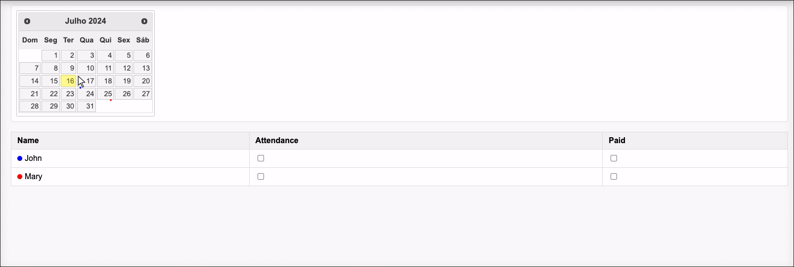

# Flask Presence Logger

Flask Presence Logger is a simple web application to track attendance and payments using a calendar interface. The application is built with Flask and uses Docker for containerization.

## Features

- Track attendance and payments for users.
- Calendar interface to select dates and view attendance records.
- REST API for fetching and updating attendance data.




## Prerequisites

- Docker
- Docker Compose

## Getting Started

### Clone the Repository

```bash
git clone https://github.com/gustavoguarda/flask-presence-logger.git
cd flask-presence-logger
```


Build and Run the Application
To build and run the application using Docker Compose, execute the following command:

```bash
docker compose up --build
```

This will build the Docker image and start the Flask application. The application will be accessible at http://localhost:5000.

